# Flower Power (Prilblume)

by IOIO72 aka Tamio Patrick Honma (https://honma.de)

## Description

The "Pril-Blume" is a geometric representation of a flower and an iconic part of a campaign in the 1970s for Henkel's dishwashing liquid Pril. These flowers were stickers that accompanied the labels of the bottles. The stickers were very popular and still known as a retro piece of pop art.

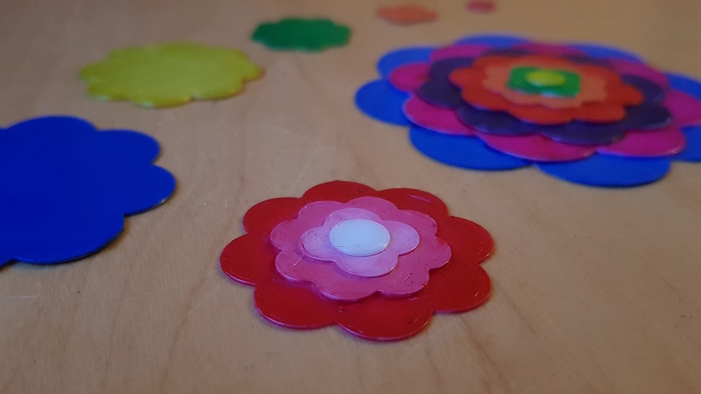
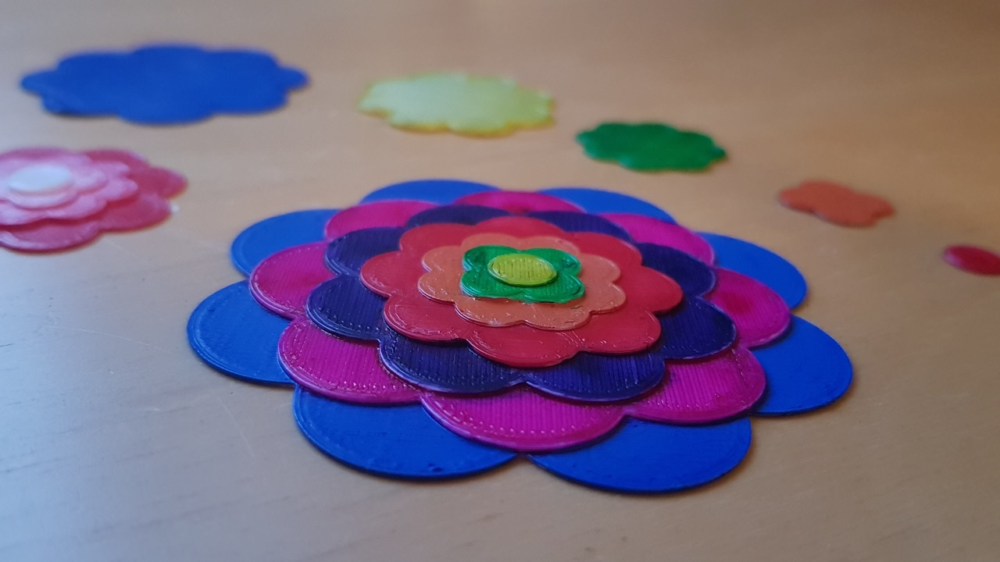
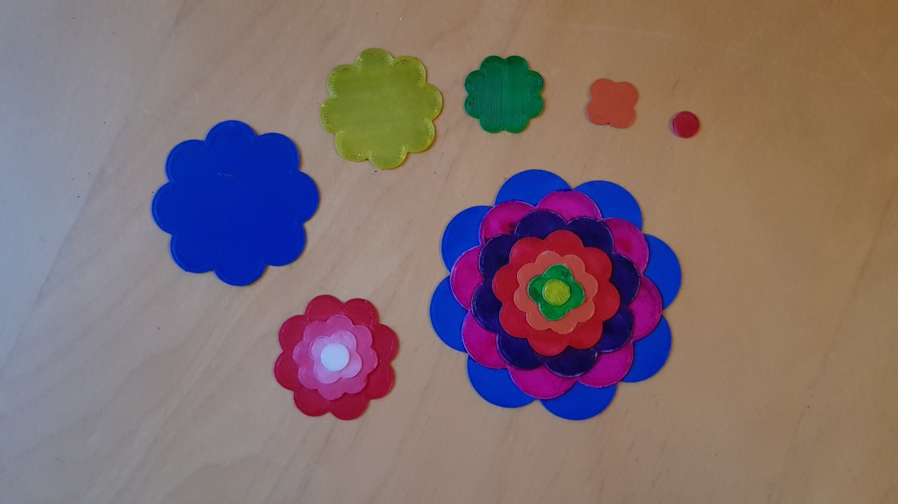

## Customize the flower

By default the customizer is set to the original design properties. You have many options for variations of the flower and you are able to choose from different export options to print the flower as one complete mesh or in parts to print them with different filament colors.

In addition to the flower customization you can set a label text to create a flower power label tag.

The customizer options have descriptions to understand all possibilities. So, simply read them and play around with the properties.

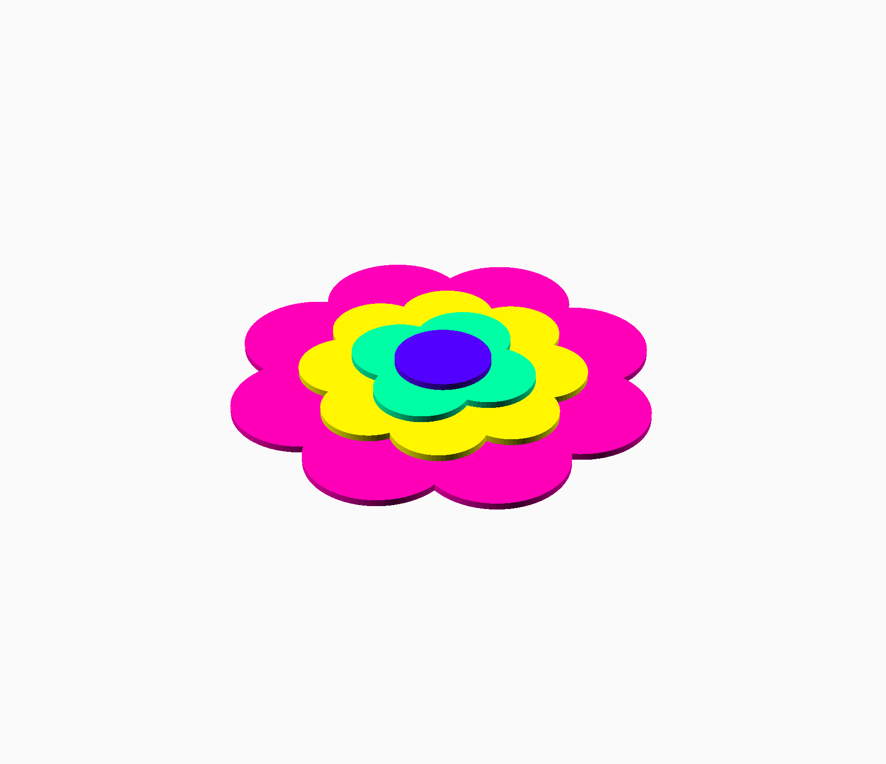
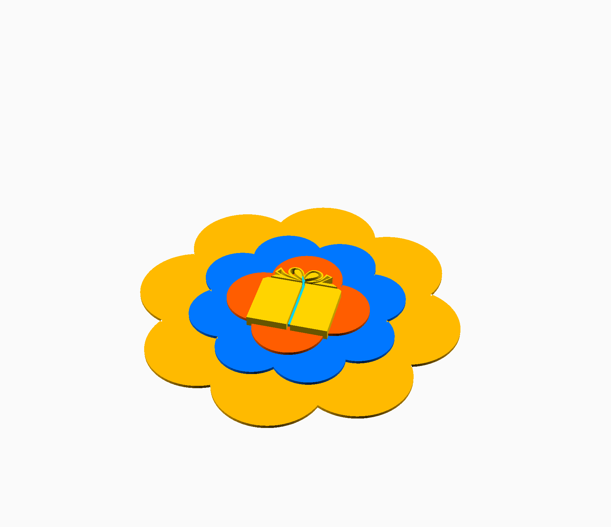
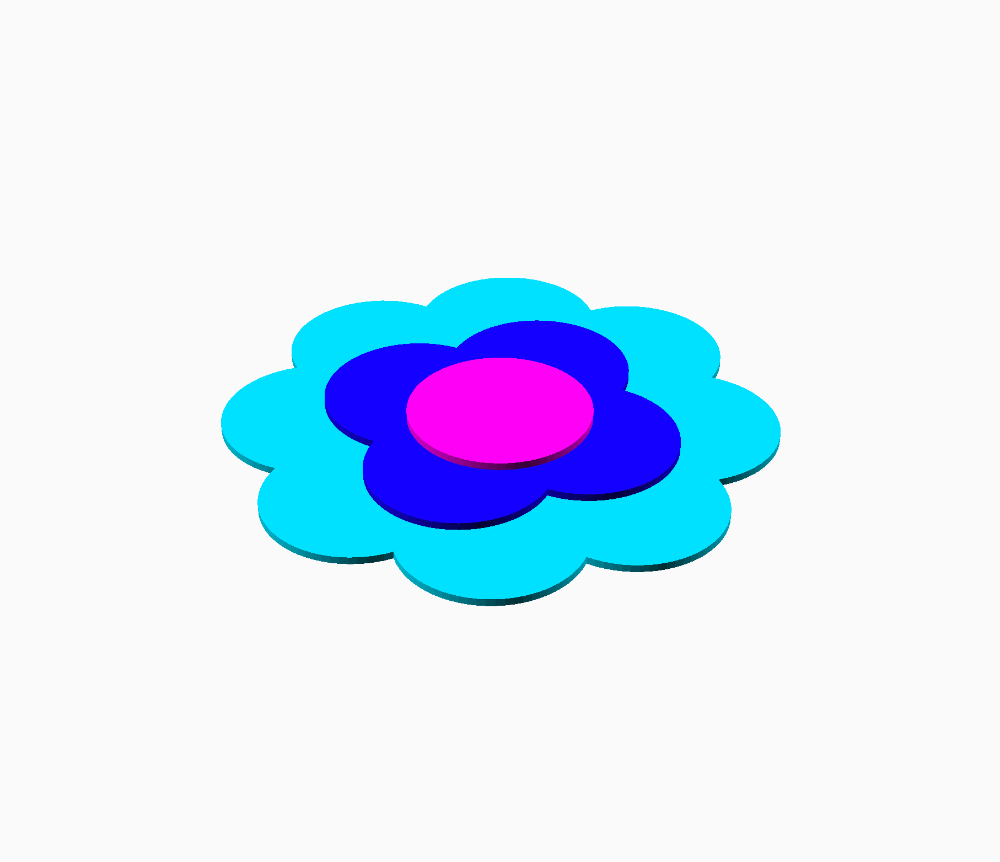
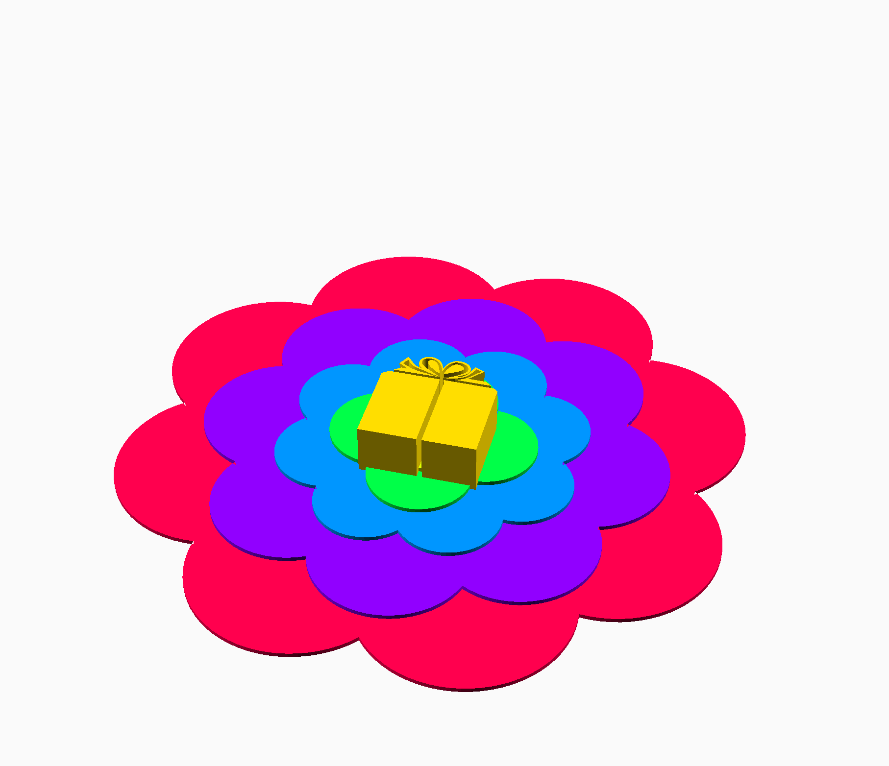
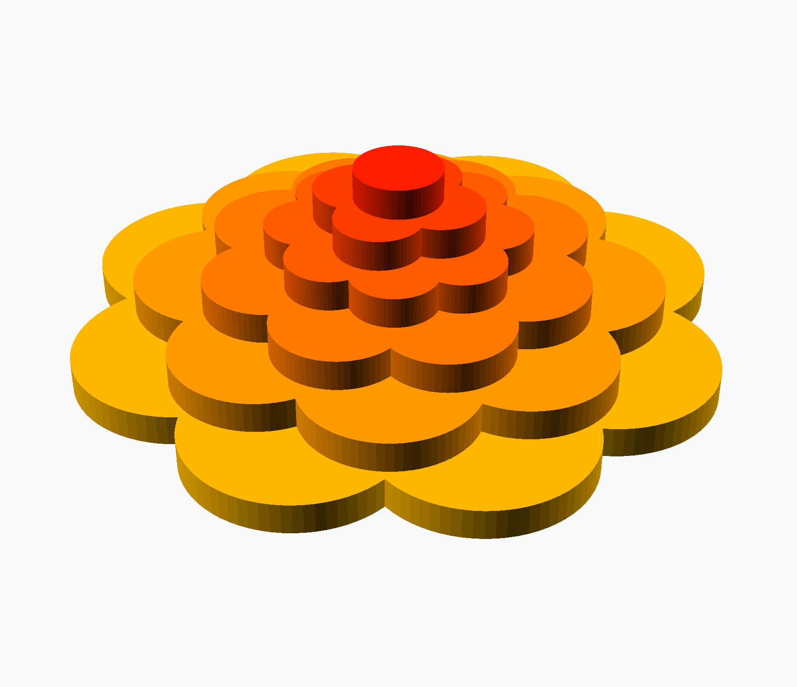
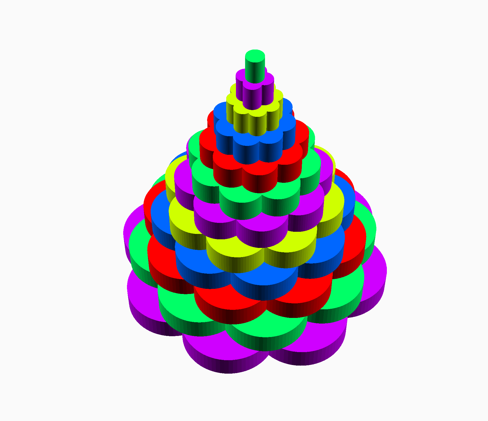
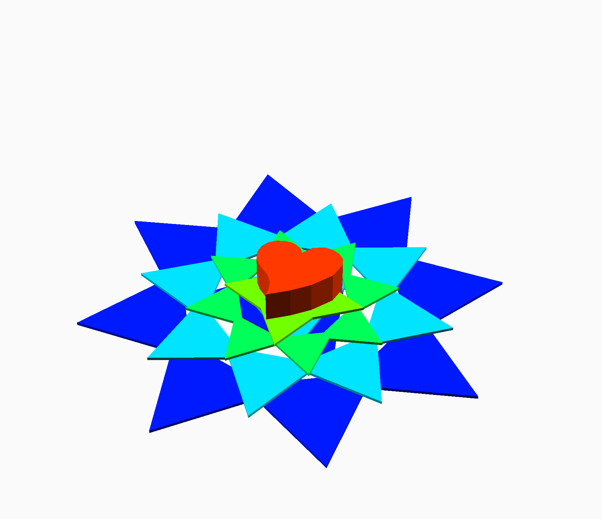
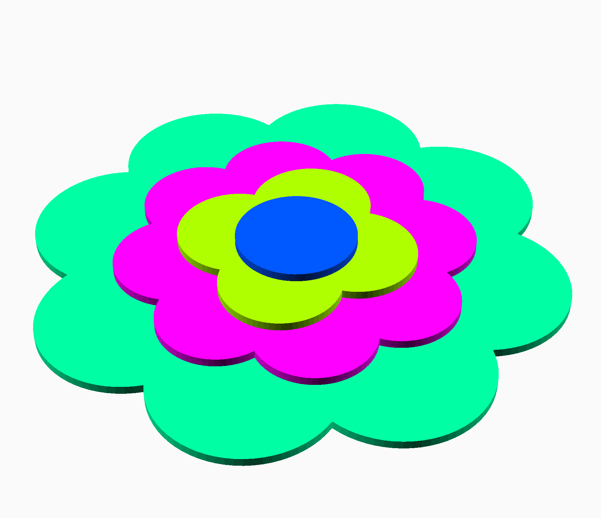
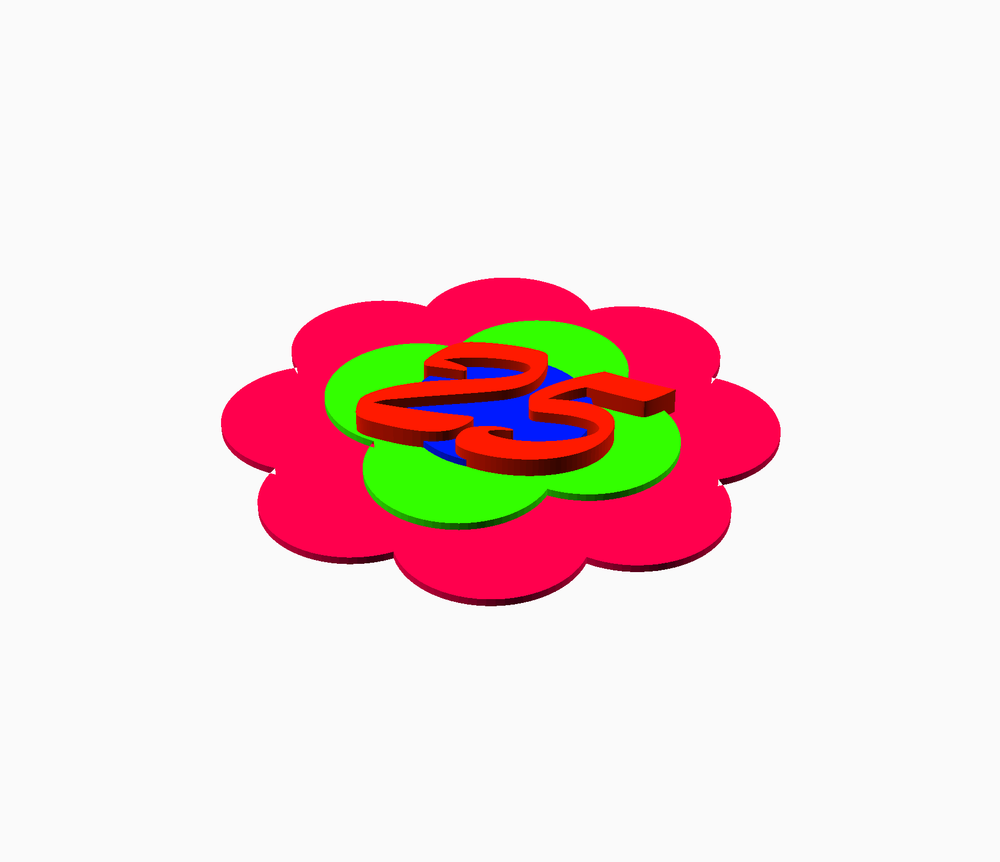

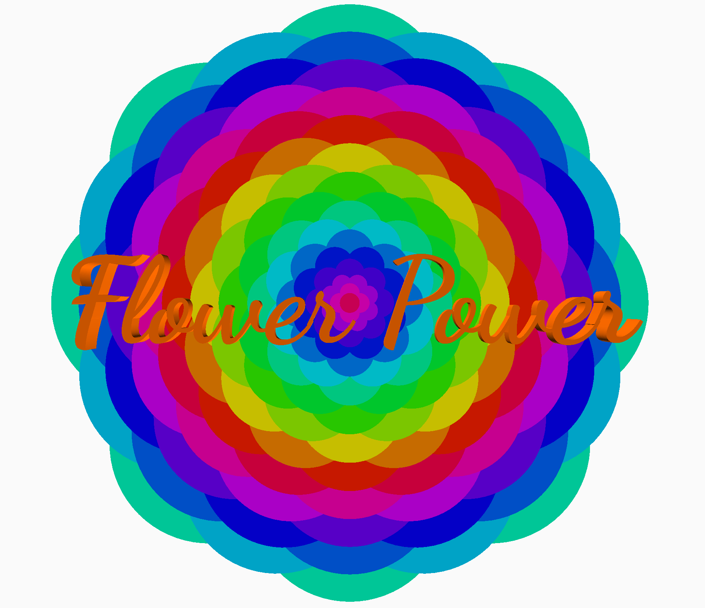

## Use OpenSCAD

1. **Download and install:** [OpenSCAD](http://openscad.org/) version 2021.01 or newer
2. **Download:** The *.scad file of this model.
3. **Start** OpenSCAD and **open** the *.scad file in it.
4. **Open the customizer** via the menu "Window/Customizer"

Now you can configure the model and use the `F5` key to render the preview of your changes.

### Export your STL file

If you're done with your model settings, you can export the STL file:

1. Render the mesh by pressing the `F6` key.
2. Wait until the rendering is finished. This might take some minutes.
3. Export the STL file by pressing the `F7` key.

### Optionally save your configuration

If you like to use your configuration as a template for further models, it's a good idea, to save your configuration:

1. Click the `+` symbol in the customizer, which you find beside the configuration selector drop-down in the second line of the customizer.
2. Give your configuration a name.

Use the drop-down menu to access your saved configurations.

## Some more information

- [Henkel zur Pril-Blume](https://www.henkel.de/spotlight/2015-02-25-ein-klassiker-der-nie-verblueht-396600)
- [Wikipedia zur Prilblume](https://de.wikipedia.org/wiki/Prilblume)
- [Pril-Blume Wort-Bildmarke gelöscht](https://register.dpma.de/DPMAregister/marke/register/396247164/DE)

